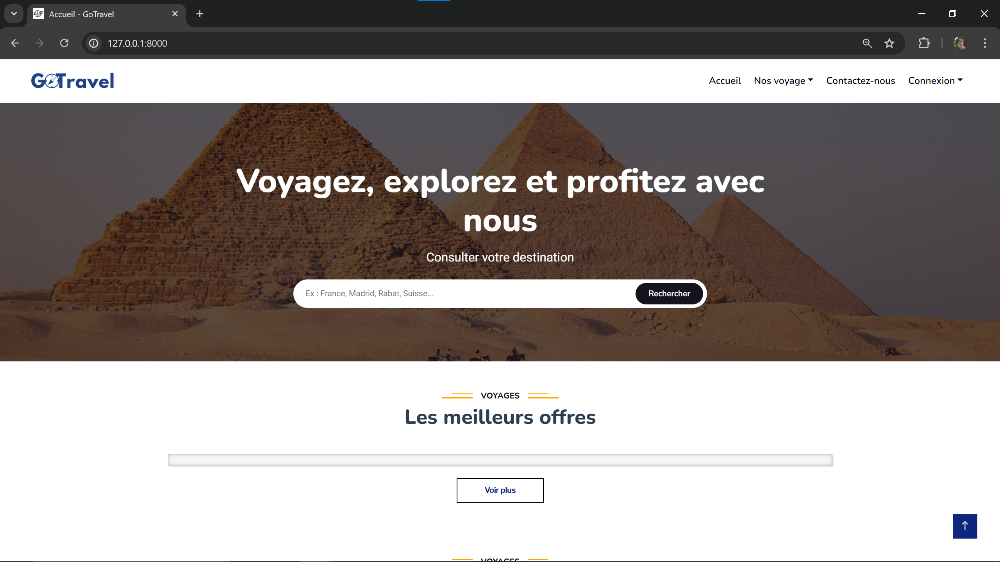
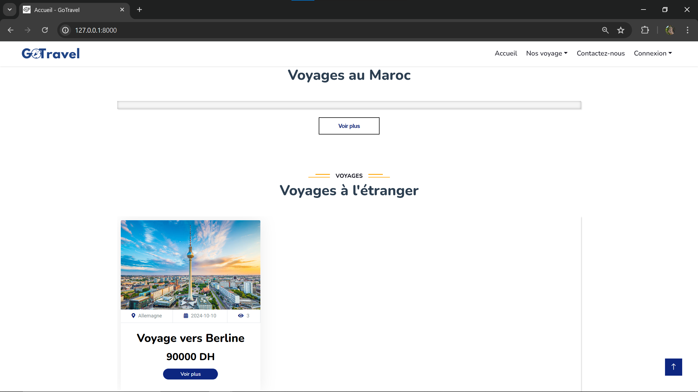
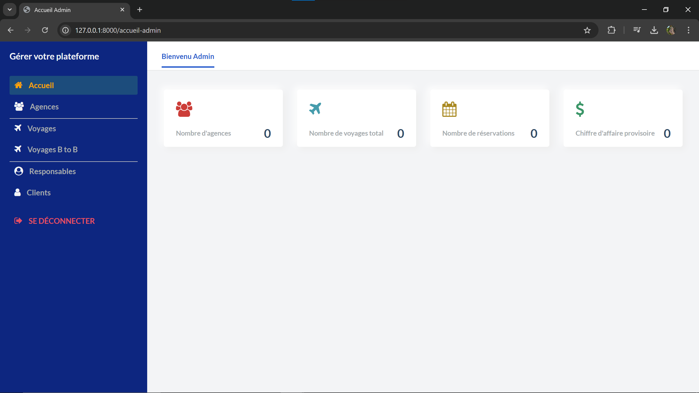

# Plateforme pour gérer les agences de voyages
Cette application web est développée en utilisant le framework Laravel et permet de gérer différentes agences qui organisent des voyages.

## Configuration requise
- PHP 8.0 ou supérieur
- Composer
- Base de données (MySQL)
- Serveur web (Apache, Nginx, etc.)

## Installation
1. Clonez le dépôt Git :
   git clone https://github.com/sife22/gotravel-laravel.git

2. Accédez au répertoire du projet :
   cd gotravel-laravel

3. Installez les dépendances avec Composer :
   composer install

4. Copiez le fichier '.env.example' vers '.env' et configurez les paramètres de connexion à la base de données via la commande suivante :
   cp .env.example .env

5. Générez la clé d'application Laravel :
   php artisan key:generate

6. Exécutez les migrations pour créer les tables de la base de données :
   php artisan migrate

7. Démarrez le serveur de développement :
   php artisan serve

8. Accédez à l'application dans votre navigateur à l'adresse 'http://localhost:8000'.

## Quelques captures d'écran

## ...

